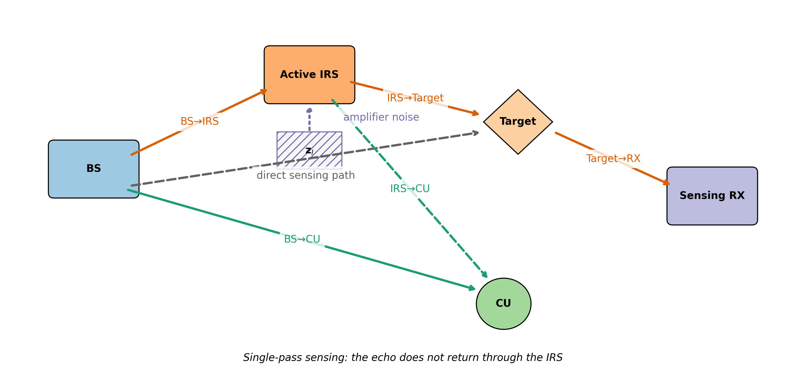
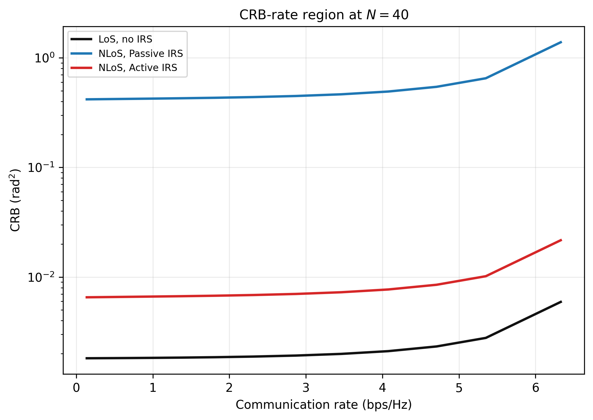
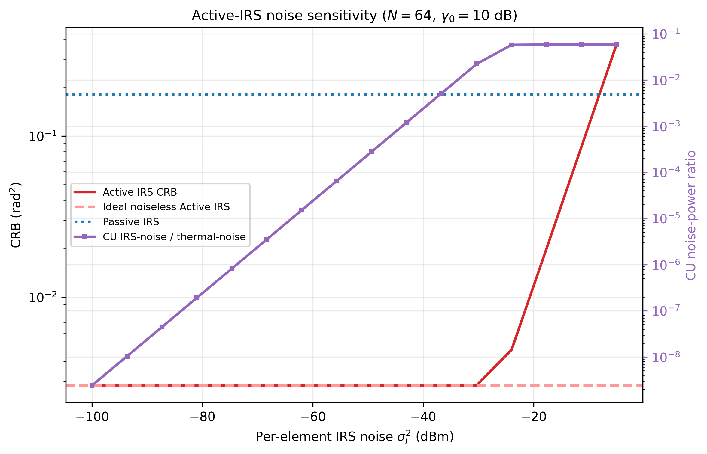

# Single-Pass Active IRS Assisted Bistatic ISAC

面向双站 ISAC 的数值研究代码。项目以
*CRB-Rate Tradeoff for Bistatic ISAC* 的 CRB-rate 模型为基础，加入
只辅助前向照射的单程 Passive/Active IRS。

本项目不实现`BS -> RIS -> Target -> RIS -> BS` 的双程感知 FIM。

## Highlights

### System model



### CRB-rate tradeoff



### Active-IRS noise sensitivity



## Model

BS 发射通信信号与确定性感知信号，其协方差分别为
$\mathbf R_c$ 和 $\mathbf R_s$：

$$
\mathrm{tr}(\mathbf R_c+\mathbf R_s)\le P.
$$

通信端采用列信道约定 $y_c=\mathbf h_{\rm eff}^H\mathbf x+n_c$：

$$
\mathbf h_{\rm eff}
=\mathbf h+\mathbf G^H\mathrm{diag}(\mathbf v^*)\mathbf h_{rc}.
$$

Active IRS 放大噪声独立进入 SINR 分母：

$$
\gamma_c=
\frac{\mathbf h_{\rm eff}^H\mathbf R_c\mathbf h_{\rm eff}}
{\mathbf h_{\rm eff}^H\mathbf R_s\mathbf h_{\rm eff}
+\sigma_c^2+\sigma_I^2
\left\|\mathrm{diag}(\mathbf v^*)\mathbf h_{rc}\right\|^2}.
$$

感知端保留 *CRB-Rate Tradeoff for Bistatic ISAC* 的
$\mathbf H=\alpha\mathbf b\mathbf a^T$ 约定：

$$
\mathbf a_{\rm eff}
=\mathbf a_{\rm dir}+\mathbf G^T\mathrm{diag}(\mathbf v)\mathbf h_r.
$$

因此目标方向功率是
$\mathbf a_{\rm eff}^T\mathbf R\mathbf a_{\rm eff}^*$，不是
$\mathbf a_{\rm eff}^H\mathbf R\mathbf a_{\rm eff}$。

Active IRS 还满足

$$
\lvert v_n\rvert\le A_{\max},
\quad
\sum_n\lvert v_n\rvert^2
\left([\mathbf G(\mathbf R_c+\mathbf R_s)\mathbf G^H]_{n,n}
+\sigma_I^2\right)
\le P_{\rm RIS}.
$$


## Features

- *CRB-Rate Tradeoff for Bistatic ISAC* Case-2 CRB 与 CRB-rate 优化；
- Passive/Active IRS 单程前向信道；
- CU 端 Active-IRS 放大噪声；
- Active-IRS 单元幅度与总输出功率约束；
- SCA 优化 $\mathbf R_c,\mathbf R_s$；
- SDR/AO 优化 IRS 系数，并独立复核恢复解的可行性；
- 相位对齐快速基线与可重复的 SINR 扫描；
- 每次运行保存数据、图和完整参数元数据。

## Installation

Python 3.10 或更高版本：

```bash
python -m venv .venv
# Windows
.venv\Scripts\activate
# Linux/macOS
source .venv/bin/activate

python -m pip install -r requirements.txt
```

CVXPY 默认使用 SCS。若使用其他求解器，请同时检查精度和可行性容差。

## Run

```bash
python run_simulation.py
```

结果写入：

```text
results/runs/<timestamp>/
├── crb_vs_sinr_data.npz
├── crb_vs_sinr.png
└── metadata.json
```

生成结果、日志、本地测试和慢速验证文件不会提交到 Git。

### Paper figure suite

```bash
python paper_figures.py
```

该入口集中生成论文所需的全部图表，输出到
`results/paper_figures/`。数值点保存在 `metric_cache.json`，重复运行时会
复用已有结果。该目录默认不提交到 Git，待确认最终图表后再选择性纳入。

| Output | Content |
|---|---|
| Fig. 1 | 单程 Active-IRS 双站 ISAC 系统模型 |
| Fig. 2 | Passive/Active IRS 的 SCA 收敛曲线 |
| Fig. 3(a) | $N=40$ 时的核心 CRB-rate 区域 |
| Fig. 3(b) | 固定 IRS 类型下不同阵元数的 CRB-rate 区域 |
| Fig. 4 | CRB 随通信 SINR 门限的变化 |
| Fig. 5 | Passive/Active IRS 在不同 SINR 下的阵元数缩放 |
| Fig. 6(a)/(b) | CRB 与 IRS 输出功率随 $A_{\max}$ 的变化 |
| Fig. 7 | CRB 随 Active-IRS 功率预算的变化 |
| Fig. 8 | CRB 与 CU 噪声功率比的双纵轴噪声敏感性图 |
| Fig. 10 | 相同 BS 功率与相同系统总功率两种比较口径 |
| Table 1 | 仿真参数 |
| Table 3 | 核心场景结果汇总 |

所有 CRB 纵轴均绘制实际 CRB，不进行 dB 转换。
图1至图10的编号有意跳过图9，表格编号有意跳过表2。

## Configuration

所有主要参数位于 [config.py](config.py)：

| Parameter | Symbol | Default | Unit |
|---|---:|---:|---|
| BS antennas | $M_t$ | 32 | elements |
| Sensing RX antennas | $M_r$ | 32 | elements |
| Coherent samples | $T$ | 1024 | symbols |
| BS transmit power | $P$ | 30 | dBm |
| Active-IRS power budget | $P_{\rm RIS}$ | 10 | dBm |
| Maximum IRS amplitude | $A_{\max}$ | 8 | linear |
| IRS noise per element | $\sigma_I^2$ | -80 | dBm |
| CU receiver noise | $\sigma_c^2$ | -80 | dBm |
| Sensing RX noise | $\sigma_s^2$ | -80 | dBm |
| Path-loss reference | $K_0$ | -30 | dB |
| Path-loss exponent | $\alpha_0$ | 2.5 | — |
| Rician factor | $K_c$ | 1 | linear |
| IRS elements | $N$ | 16, 32, 64, 128 | elements |
| SINR threshold sweep | $\gamma_0$ | -10 to 19 | dB |
| Direct / IRS-CU seeds | — | 46 / 47 | — |

主曲线使用 `MAIN_IRS_STRATEGY="alignment"`，默认功率比较口径为
`POWER_ACCOUNTING="same_bs_power"`。

`POWER_ACCOUNTING="equal_total_power"` 时，Passive/LoS 场景会把 Active
IRS 的额外功率预算加到 BS，以形成相同系统总功率对照。

## Selected results

用于代码仓库展示的结果位于 `figures/`：

- `system_model.png`：单程 Active-IRS 双站 ISAC 系统模型；
- `convergence.png`：Passive/Active IRS 的 SCA 收敛曲线；
- `crb_rate_tradeoff.png`：核心 CRB-rate 权衡；
- `crb_vs_array_size.png`：不同 SINR threshold 下的 IRS 阵列规模效应；
- `crb_vs_irs_power.png`：Active-IRS 功率预算敏感性；
- `active_irs_noise_sensitivity.png`：Active-IRS 噪声敏感性；
- `power_accounting.png`：相同 BS 功率与相同总功率比较；
- `core_results.csv`：固定核心场景下的数值结果。

## Repository layout

```text
config.py             simulation parameters
channel_constant.py   geometry and reproducible channel initialization
channels.py           channel, IRS noise, and IRS power models
crb.py                bistatic CRB formulas
rate.py               communication SINR and rate
sca_solver.py         transmit-covariance SCA solver
irs_solver.py         IRS SDR recovery and AO loop
scenario.py           SINR sweep and diagnostics
run_simulation.py     main experiment
run_position_scan.py  passive-IRS position pre-screening
plot_irs.py           result plotting
paper_figures.py      complete paper figure and table suite
docs/                 model guide and formula audit
```

## Interpretation limits

- 主曲线默认是相位对齐基线，不是完整 AO 最优曲线。
- 当前默认参数下 Active IRS 主要受 $A_{\max}$ 限制；总功率约束和
  放大噪声几乎不活跃，因此不能据此声称观察到了噪声-功率折中。
- 第一遍 IRS 噪声经目标反射后的功率会被记录为诊断量，但在默认几何下
  远低于 sensing RX 热噪声，故 CRB 保留
  *CRB-Rate Tradeoff for Bistatic ISAC* 的白噪声模型。
- 绝对 CRB 取决于目标 RCS、阵列增益和双站路径损耗假设；跨论文比较时
  应优先比较趋势与缩放规律。

## References

1. *CRB-Rate Tradeoff for Bistatic ISAC*, IEEE TWC, 2026.
2. Q. Zhu et al., *Cramér-Rao Bound Optimization for Active
   RIS-Empowered ISAC Systems*, IEEE TWC, 2024.

## License

This project is released under the [MIT License](LICENSE).

Copyright © 2026 Huanyu Zhang.
